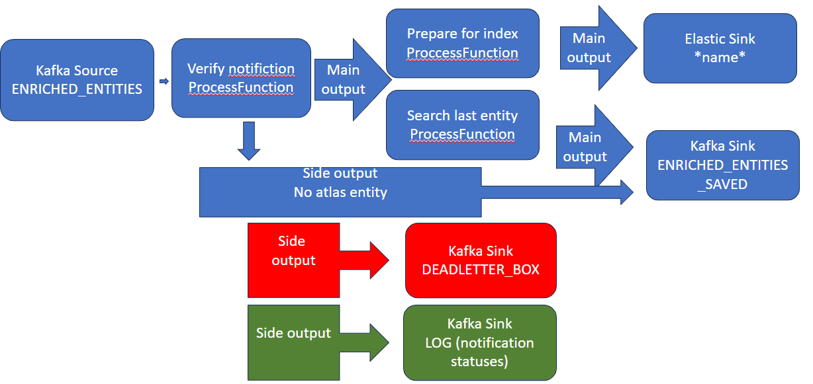

## Specification 

### Input

#### ENRICHED_ENTITIES kafka topic

json data from Kafka topic have a next format

    msg_creation_time: int
    event_time: int
    atlas_entity_audit: dict
    supertypes: list
    kafka_notification: Optional[dict] = None
    atlas_entity: Optional[dict] = None
    previouse_version: Optional[dict] = None     AW: is this already in the input? Are you sure?

### Output

#### ENRICHED_ENTITIES_SAVED  kafka topic

json data to Kafka topic have a next format

    msg_creation_time: int
    event_time: int
    atlas_entity_audit: dict
    supertypes: list
    kafka_notification: Optional[dict] = None
    atlas_entity: Optional[dict] = None
    previouse_version: Optional[dict] = None

json data to Kafka topic have a next format
#### deadletterbox kafka topic

	timestamp: int
    original_notification: str
    job: str
    description: str
    exception_class: str
    remark: str

### Process 

#### 1. Check input

* if not follow the specification produce deadletterbox message
* if input has no kafka_notification produce deadletterbox message

#### 2. Process input 
* if no altas entity atlas_entity, set previouse_version to None, produce ENRICHED_ENTITIES_SAVED and finish
* if no guid in input kafka_notification.entity make warn log 
* index with doc_id = quid+msg_creation_time next document

		{"msgCreationTime": msg_creation_time, "eventTime": event_time, "body": atlas_entity }

* find in elastic document with same guid but indexed earlier and set previouse_version field with it
* produce updated input to ENRICHED_ENTITIES_SAVED and finish
* in case of any error produce deadletterbox message and finish

### Flink flow

#TODO: update picture

